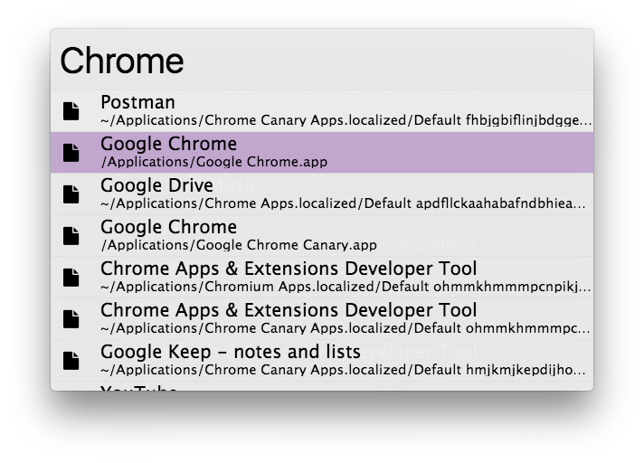

## Clean Theme

A clean theme written in SASS with node/gulp.

- Dark theme
- No logo

## Installing

Mark `singuerinc/zazu-clean-theme` inside of your `~/.zazurc.json` file.

~~~ json
{
  "theme": "singuerinc/zazu-clean-theme"
}
~~~

## Building

~~~
npm install
npm run build
~~~
